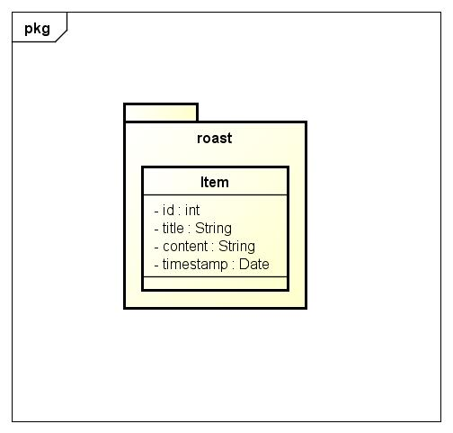

####################################################
Service Oriented Architecture and RESTful Webservice
####################################################

Requirements
============

Das neu eröffnete Unternehmen iKnow Systems ist spezialisiert auf Knowledgemanagement
und bietet seinen Kunden die Möglichkeiten Daten und Informationen jeglicher Art
in eine Wissensbasis einzupflegen und anschließend in der zentralen Wissensbasis
nach Informationen zu suchen (ähnlich wikipedia).

Folgendes ist im Rahmen der Aufgabenstellung verlangt:

- Entwerfen Sie ein Datenmodell, um die Eintraege der Wissensbasis zu speichern und um ein optimitiertes Suchen von Eintraegen zu gewaehrleisten. [2Pkt]

- Entwickeln Sie mittels RESTful Webservices eine Schnittstelle, um die Wissensbasis zu verwalten. Es muessen folgende Operationen angeboten werden:

  - Hinzufuegen eines neuen Eintrags
  - Aendern eines bestehenden Eintrags
  - Loeschen eines bestehenden Eintrags
  
  Alle Operationen muessen ein Ergebnis der Operation zurueckliefern. [3Pkt]

- Entwickeln Sie in Java ein SOA Webservice, dass die Funktionalitaet Suchen anbietet und das SOAP Protokoll einbindet. Erzeugen Sie fuer dieses Webservice auch eine WSDL-Datei. [3Pkt]

- Entwerfen Sie eine Weboberflaeche, um die RESTful Webservices zu verwenden. [3Pkt]

- Implementieren Sie einen einfachen Client mit einem User Interface (auch Commandline UI moeglich), der das SOA Webservice aufruft. [2Pkt]

- Dokumentieren Sie im weiteren Verlauf den Datentransfer mit SOAP. [1Pkt]

- Protokoll ist erforderlich! [2Pkt]

Info:

Gruppengroesse: 2 Mitglieder

Punkte: 16

Zum Testen bereiten Sie eine Routine vor, um die Wissensbasis mit einer 1 Million
Datensaetze zu fuellen. Die Datensaetze sollen mindestens eine Laenge beim
Suchbegriff von 10 Zeichen und bei der Beschreibung von 100 Zeichen haben!Ist die
Performance bei der Suche noch gegeben?

Design
======

We first looked around for already existing tutorials/examples on the two
implementations and found them.

Based on those, the design was done.

Both implementations share the following aspects:

- A central Item class represents a knowledge entry in the database. It will
  be expanded with Hibernate annotations.
  The target is to also use this class when returning the results to the client.
- After some research on how to use Hibernate together with Spring, a
  HibernateXMLConfig class will be implemented which simply tells Spring to
  configure hibernate based on directives located in hibernate.cfg.xml.
- Additionally, a hibernate.cfg.xml and hibernate.properties file will be used
  to configure Spring and Hibernate together.

**ReST**

The ReST implementation is based on the official example provided by Spring.
It can be found under [1]_ and covers the requirements pretty well already.

Based on that, the design is as follows:

- The ItemController will be annoted with a RestController (just like in the
  example) and provides the PUT, POST, DELETE and for testing, GET methods.
  It also handles the actual querying of the database and returns the results
  from it.
- A ItemResponse class is required to "pack" the resulting Item together
  with some more information
  It contains attributes for "error" and "success", indicating the success of
  an request and if an error occured, it will be transmitted back.

**SOA**

Similarly to ReST, there also was an example available here [2]_.

The design for this is as follows:

- ItemEndpoint will take care of the HTTP requests arriving at the application.
  Once a GET request arrives (as defined in the XSD), it contacts an instance
  of ItemRepository and passes the parameter received in the requests on it.
- ItemRepository actually performs the query and returns all results as a
  list.
- WebServiceConfig will be taken over 1:1 from the example and modified to
  fit our needs (modifying WSDL URL, endpoint, etc.)

UML
~~~

Structure
~~~~~~~~~

Please note:

As we were not able to configure Gradle properly so it provides a shared "root"
project and the actual implementations as sub projects, the locations of the
implementations are as follows:

src/ - the SOA web service

Rest/ - the ReST web service

Or said otherwise, the SOA project is the "root" project.

Troubles
========

- During implementing the ReST service, it turned out that configuring Hibernate
  Spring is harder than expected.
  First, the problem was that Hibernate was unable to find the configuration file.
  After roughly 4 hours of trial & error, it turned out that specifying a classpath:
  before the file name somehow confuses Java/Spring, causing it to not find the file.
  Once classpath: gets removed, Spring/Hibernate were finally able to find the
  configuration file.
  Secondly, the application instantly crashed after starting up, as Spring was
  unable to autowire the SessionFactory to Hibernate.
  This was caused because the configuration class was in the wrong package.
  After solving these problems, Hibernate works like a charm.
- We first tried to use the same class for Hibernate and for the XML output in
  the SOA project (the one for XML gets auto-generated when parsing the XSD definitions).
  Unfortunately, this did not work either, as Hibernate uses java.util.Date, but XML
  the GregorianCalendar class.
  We tried to use a conversion class, but this caused more problems than solving them.
  In the end, we decided to reference the Hibernate Item class by its full path
  and import the XML one.

These were the biggest problems while implementing.

Technologies
============

SOA

ReST

JSON

WSDL

Setup and Usage
===============

Before running either of the applications, please make sure that the hibernate.properties
in the respective implementation's path is configured properly.

We decided to use PostGres, so also make sure that you have one installed and
ready.

When starting the application(s) for the first time, please make sure to set hibernate.hbm-ddl.auto
to create, so that Hibernate creates the correct table.

Once that's done, set it back to update or none (speeding up start up).

Then, the application(s) can be started by simply running Gradle with the correct
parameters.

**ReST**

.. code:: bash

    ./gradlew Rest:run

This starts the ReST service on localhost, port 9090. The port can be changed in the
application.properties file.

**SOA**

.. code:: bash

    ./gradlew :run

This starts the ReST service on localhost, port 8080.

**SOA client**

.. code:: bash

    ./gradlew SOAClient:run

**ReST client**

To run the ReST client, simply open the index.html file located in RestClient/
in your browser, the communication works over AJAX.

Also make sure that you set the correct IP/Port in the respective input field.

**WSDL**

The WSDL file can either be found in the wsdl/ folder or by browsing to the
following URL after starting the SOA application:

http://127.0.0.1:8080/searchItem/item.wsdl

**Optimizing the table**

Starting from PostGres 9.1, there is a extension called "pg_trgm" available,
which allows the optimization of full text searches.

To enable it, run the following commands on the roast database:

.. code:: bash

    CREATE EXTENSION pg_trgm;
    create index trgm_idx ON item USING gin(title gin_trgm_ops);
    create index trgm_idx2 ON item USING gin(content gin_trgm_ops);

This has to be only done once after creating the table.

Testing
=======

Time recording
==============

Sources
=======

.. _1:

[1] "Getting Started &middot; Building a RESTful Web Service"
     https://spring.io/guides/gs/rest-service/
     last visited: 2015-04-15

.. _2:

[2] "Getting Started &middot; Producing a SOAP web service"
     https://spring.io/guides/gs/producing-web-service/
     last visited: 2015-04-15

.. header::

    +-------------+--------------------+------------+
    | ###Title### | Andreas Willinger, | 2015-04-17 |
    |             | Jakob Klepp        |            |
    +-------------+--------------------+------------+

.. footer::

    ###Page### / ###Total###
