####################################################
Service Oriented Architecture and RESTful Webservice
####################################################

Requirements
============

Das neu eröffnete Unternehmen iKnow Systems ist spezialisiert auf Knowledgemanagement
und bietet seinen Kunden die Möglichkeiten Daten und Informationen jeglicher Art
in eine Wissensbasis einzupflegen und anschließend in der zentralen Wissensbasis
nach Informationen zu suchen (ähnlich wikipedia).

Folgendes ist im Rahmen der Aufgabenstellung verlangt:

- Entwerfen Sie ein Datenmodell, um die Eintraege der Wissensbasis zu speichern und um ein optimitiertes Suchen von Eintraegen zu gewaehrleisten. [2Pkt]

- Entwickeln Sie mittels RESTful Webservices eine Schnittstelle, um die Wissensbasis zu verwalten. Es muessen folgende Operationen angeboten werden:

  - Hinzufuegen eines neuen Eintrags
  - Aendern eines bestehenden Eintrags
  - Loeschen eines bestehenden Eintrags
  
  Alle Operationen muessen ein Ergebnis der Operation zurueckliefern. [3Pkt]

- Entwickeln Sie in Java ein SOA Webservice, dass die Funktionalitaet Suchen anbietet und das SOAP Protokoll einbindet. Erzeugen Sie fuer dieses Webservice auch eine WSDL-Datei. [3Pkt]

- Entwerfen Sie eine Weboberflaeche, um die RESTful Webservices zu verwenden. [3Pkt]

- Implementieren Sie einen einfachen Client mit einem User Interface (auch Commandline UI moeglich), der das SOA Webservice aufruft. [2Pkt]

- Dokumentieren Sie im weiteren Verlauf den Datentransfer mit SOAP. [1Pkt]

- Protokoll ist erforderlich! [2Pkt]

Info:

Gruppengroesse: 2 Mitglieder

Punkte: 16

Zum Testen bereiten Sie eine Routine vor, um die Wissensbasis mit einer 1 Million
Datensaetze zu fuellen. Die Datensaetze sollen mindestens eine Laenge beim
Suchbegriff von 10 Zeichen und bei der Beschreibung von 100 Zeichen haben!Ist die
Performance bei der Suche noch gegeben?

Design
======

We first looked around for already existing tutorials/examples on the two
implementations and found them.

Based on those, the design was performed.

Both implementations share the following aspects:

- A central Item class represents a knowledge entry in the database. It will
  be expanded with Hibernate annotations.
  The target is to also use this class when returning the results to the client.
- After some research on how to use Hibernate together with Spring, a
  HibernateXMLConfig class will be implemented which simply tells Spring to
  configure hibernate based on directives located in hibernate.cfg.xml.
- Additionally, a hibernate.cfg.xml and hibernate.properties file will be used
  to configure Spring and Hibernate together.

**ReST**

The ReST implementation is based on the official example provided by Spring.
It can be found under [1]_ and covers the requirements pretty well already.

Based on that, the design is as follows:

- The ItemController will be annoted with a RestController (just like in the
  example) and provides the PUT, POST, DELETE and for testing, GET methods.
  It also handles the actual querying of the database and returns the results
  from it.
- A ItemResponse class is required to "pack" the resulting Item together
  with some more information
  It contains attributes for "error" and "success", indicating the success of
  an request and if an error occured, it will be transmitted back.

**SOA**

Similarly to ReST, there also was an example available here [2]_.

The design for this is as follows:

- ItemEndpoint will take care of the HTTP requests arriving at the application.
  Once a GET request arrives (as defined in the XSD), it contacts an instance
  of ItemRepository and passes the parameter received in the requests on it.
- ItemRepository actually performs the query and returns all results as a
  list.
- WebServiceConfig will be taken over 1:1 from the example and modified to
  fit our needs (modifying WSDL URL, endpoint, etc.)

UML
~~~

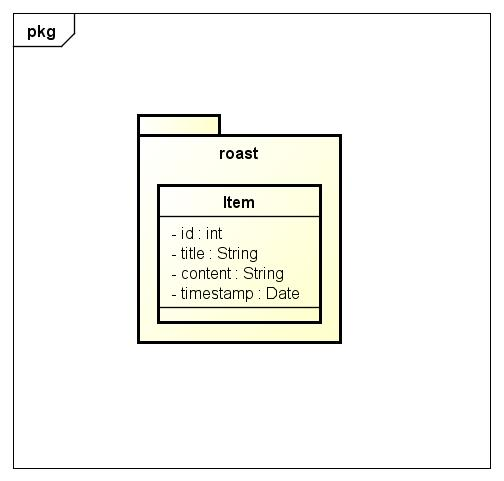

Structure
~~~~~~~~~

Please note:

As we were not able to configure Gradle properly so it provides a shared "root"
project and the actual implementations as sub projects, the locations of the
implementations are as follows:

src/ - the SOA web service

Rest/ - the ReST web service

Or said otherwise, the SOA project is the "root" project.

Troubles
========

- During implementing the ReST service, it turned out that configuring Hibernate
  Spring is harder than expected.
  First, the problem was that Hibernate was unable to find the configuration file.
  After roughly 4 hours of trial & error, it turned out that specifying a classpath:
  before the file name somehow confuses Java/Spring, causing it to not find the file.
  Once classpath: gets removed, Spring/Hibernate were finally able to find the
  configuration file.
  Secondly, the application instantly crashed after starting up, as Spring was
  unable to autowire the SessionFactory to Hibernate.
  This was caused because the configuration class was in the wrong package.
  After solving these problems, Hibernate works like a charm.
- We first had problems figuring out how to actually correctly send messages to
  the ReST server, but figured it out later.
  You simply send the message with the same attributes as the class is defined.
- We first tried to use the same class for Hibernate and for the XML output in
  the SOA project (the one for XML gets auto-generated when parsing the XSD definitions).
  Unfortunately, this did not work either, as Hibernate uses java.util.Date, but XML
  the GregorianCalendar class.
  We tried to use a conversion class, but this caused more problems than solving them.
  In the end, we decided to reference the Hibernate Item class by its full path
  and import the XML one.

These were the biggest problems while implementing.

Technologies
============

SOA
~~~

"A service-oriented architecture is essentially a collection of services. These
services communicate with each other. The communication can involve either simple
data passing or it could involve two or more services coordinating some activity.
Some means of connecting services to each other is needed." [3]_

ReST
~~~~

"Representational State Transfer (REST) is a style of architecture based on a set
of principles that describe how networked resources are defined and addressed.
These principles were first described in 2000 by Roy Fielding as part of his doctoral
dissertation. REST is an alternative to SOAP and JavaScript Object Notation (JSON).

It is important to note that REST is a style of software architecture as opposed
to a set of standards. As a result, such applications or architectures are
sometimes referred to as RESTful or REST-style applications or architectures.
REST has proved to be a popular choice for implementing Web Services." [4]_

JSON
~~~~

"JSON (JavaScript Object Notation) is a lightweight data-interchange format. It
is easy for humans to read and write. It is easy for machines to parse and
generate. It is based on a subset of the JavaScript Programming Language, Standard
ECMA-262 3rd Edition - December 1999. JSON is a text format that is completely
language independent but uses conventions that are familiar to programmers of
the C-family of languages, including C, C++, C#, Java, JavaScript, Perl, Python,
and many others. These properties make JSON an ideal data-interchange language." [5]_

It is used to exchange data in the ReST implementation between server and client.

Spring
~~~~~~

"Spring Framework is a Java platform that provides comprehensive infrastructure
support for developing Java applications. Spring handles the infrastructure so
you can focus on your application.

Spring enables you to build applications from “plain old Java objects” (POJOs)
and to apply enterprise services non-invasively to POJOs. This capability applies
to the Java SE programming model and to full and partial Java EE.

Examples of how you, as an application developer, can use the Spring platform advantage:

- Make a Java method execute in a database transaction without having to deal with transaction APIs.

- Make a local Java method a remote procedure without having to deal with remote APIs.

- Make a local Java method a management operation without having to deal with JMX APIs.

- Make a local Java method a message handler without having to deal with JMS APIs." [6]_

We decided to use Spring as it makes developing the web applications much more
easier and there are a lot of examples available to quickly start off.

Setup and Usage
===============

Before running either of the applications, please make sure that the hibernate.properties
in the respective implementation's path is configured properly.

We decided to use PostGres, so also make sure that you have one installed and
ready.

When starting the application(s) for the first time, please make sure to set hibernate.hbm-ddl.auto
to create, so that Hibernate creates the correct table.

Once that's done, set it back to update or none (speeding up start up).

Then, the application(s) can be started by simply running Gradle with the correct
parameters.

**ReST**

.. code:: bash

    ./gradlew Rest:run

This starts the ReST service on localhost, port 9090. The port can be changed in the
application.properties file.

**SOA**

.. code:: bash

    ./gradlew :run

This starts the ReST service on localhost, port 8080.

When running the application for the first time, xjc will be called, which generates
Java class files and the WSDL definition from an XSD.

The XSD can be be found in src/main/resources/item.xsd and contains all definitions.

**SOA client**

.. code:: bash

    ./gradlew SOAClient:run

After starting the application, you will be prompted to enter the URL of the SOA
server and decide if you want to redirect the results into a file or not.

To see how it looks like, see the testing section below.

Please keep in mind that if you update the XSD and regenerate the class files/WSDL
with xjc, you must copy over the generated classes to this project.

Otherwise, the server might not understand what the client sends.

**ReST client**

The ReST client is hosted as a static asset on the ReST server and located in its
resources/public directory.

To use it, browse to the URL where the ReST server is running on, but leave out
any file specifiers (i.e. access /).

Example: http://localhost:9090/

**WSDL**

The WSDL file can either be found in the wsdl/ folder or by browsing to the
following URL after starting the SOA application:

http://127.0.0.1:8080/searchItem/item.wsdl

**Optimizing the table**

Starting from PostGres 9.1, there is a extension called "pg_trgm" available,
which allows the optimization of full text searches.

To enable it, run the following commands on the roast database:

.. code:: bash

    CREATE EXTENSION pg_trgm;
    create index trgm_idx ON item USING gin(title gin_trgm_ops);
    create index trgm_idx2 ON item USING gin(content gin_trgm_ops);

This has to be only done once after creating the table.

Data transfer in SOA
====================

For our first tests, we created a simple request.xml file, which looks like
follows:

.. code:: xml

    <soapenv:Envelope xmlns:soapenv="http://schemas.xmlsoap.org/soap/envelope/"
				  xmlns:gs="http://roast.io">
       <soapenv:Header/>
       <soapenv:Body>
          <gs:getItemRequest>
             <gs:query>Test</gs:query>
          </gs:getItemRequest>
       </soapenv:Body>
    </soapenv:Envelope>

The getItemRequest needs to have the same fields as defined in the WSDL.

To send it, one can simply use curl:

.. code:: bash

    curl --header "content-type: text/xml" -d @request.xml http://127.0.0.1:8080/searchItem

The response looks like this:

.. code:: xml

    <SOAP-ENV:Envelope xmlns:SOAP-ENV="http://schemas.xmlsoap.org/soap/envelope/">
        <SOAP-ENV:Header/>
        <SOAP-ENV:Body>
            <ns2:getItemResponse xmlns:ns2="http://roast.io">
                <ns2:response>
                    <ns2:id>10</ns2:id>
                    <ns2:title>Test</ns2:title>
                    <ns2:content>A very long content inhalt</ns2:content>
                    <ns2:timestamp>1970-01-17+01:00</ns2:timestamp>
                </ns2:response>
                <ns2:response>
                    <ns2:id>11</ns2:id>
                    <ns2:title>Test 2</ns2:title>
                    <ns2:content>A very long content inhalt 77777</ns2:content>
                    <ns2:timestamp>1970-01-17+01:00</ns2:timestamp>
                </ns2:response>
            </ns2:getItemResponse>
        </SOAP-ENV:Body>
    </SOAP-ENV:Envelope>

There are of course libraries for Java which take care of the communication.

One of them is the Jaxb2Marshaller, provided by Spring.

Testing
=======

ReST client
~~~~~~~~~~~

The ReST client can be used in every modern web browser that supports JavaScript
and ideally, HTML5 (it will work without HTML5 too, but will not look that fancy).

Adding a new item
-----------------

The adding item tab is the default one and is therefore showed once you open the
webpage for the first time.

The initial form:

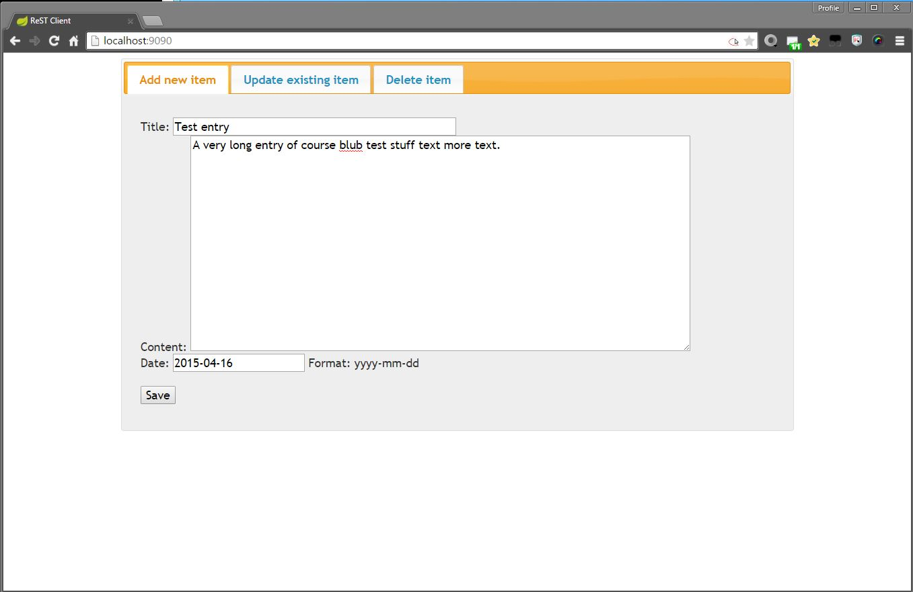

Example response:

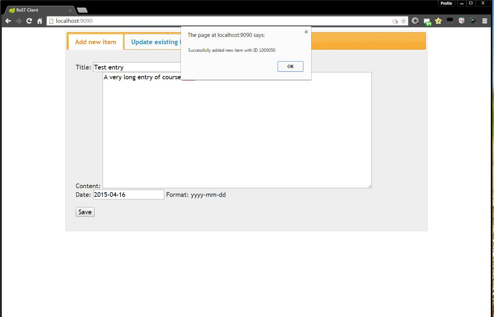

If the DB connection is down for example, a error message dialogue will be shown
with some more information about the error itself.

Updating an existing item
-------------------------

First, you have to enter the unique ID of the item you want to update.

It can be retrieved by, for example, using the SOA client for querying.

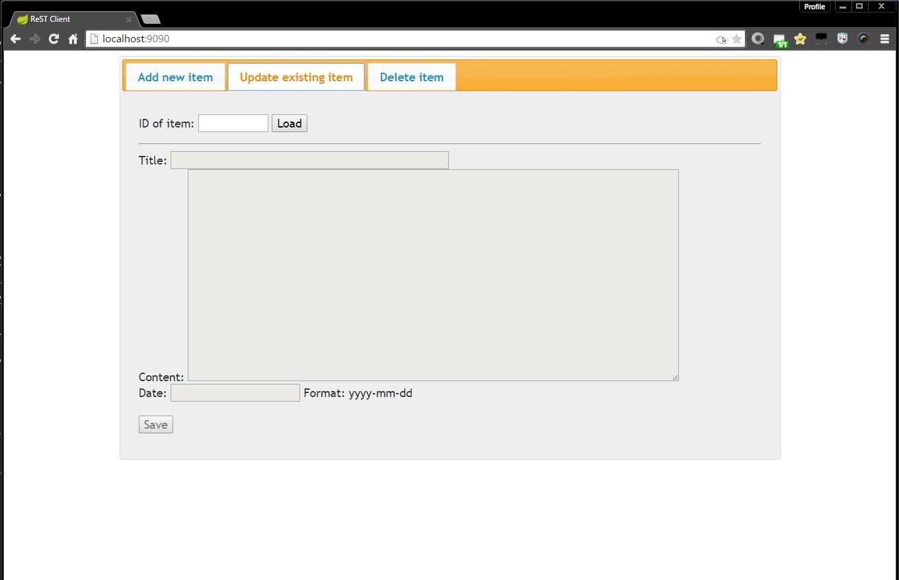

After clicking on "load" a request is sent to the server and the current data of
the item will be loaded.

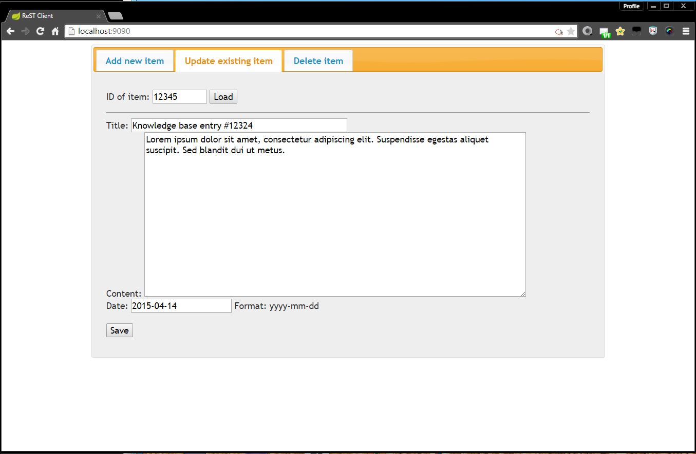

Then, the item itself can be updated.

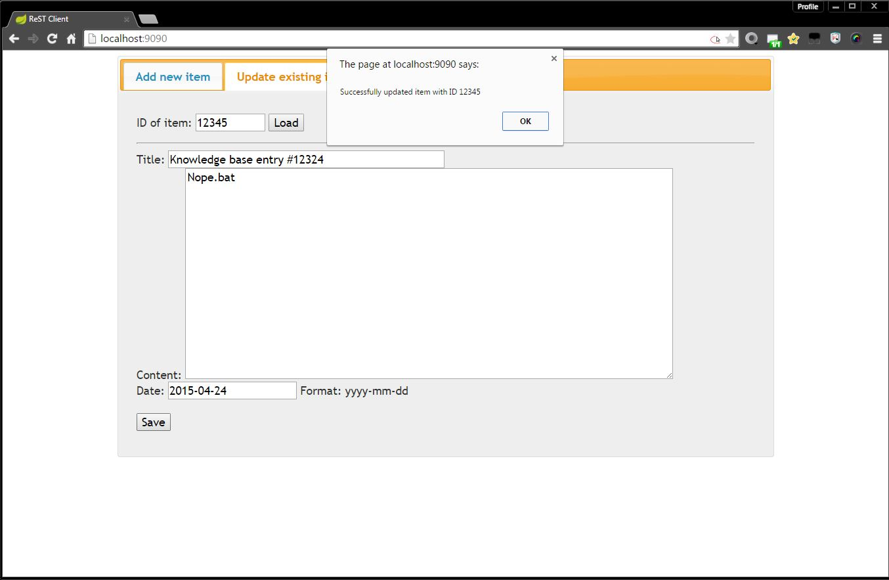

Deleting an item
----------------

Similar to the update item form, the delete form also requires the unique item ID
of the entry you want to delete.

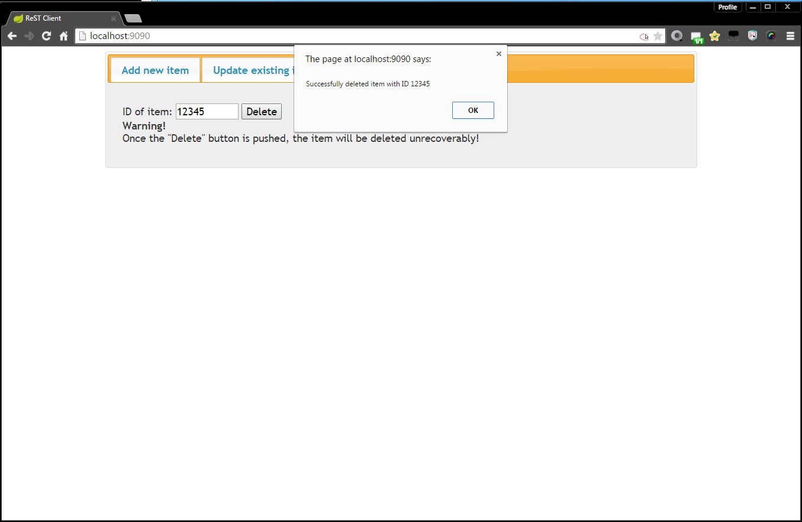

SOA client
~~~~~~~~~~

The SOA client can be set to either directly print the results out in the CLI or
save them to a file.

Direct output
-------------

Smallish result:

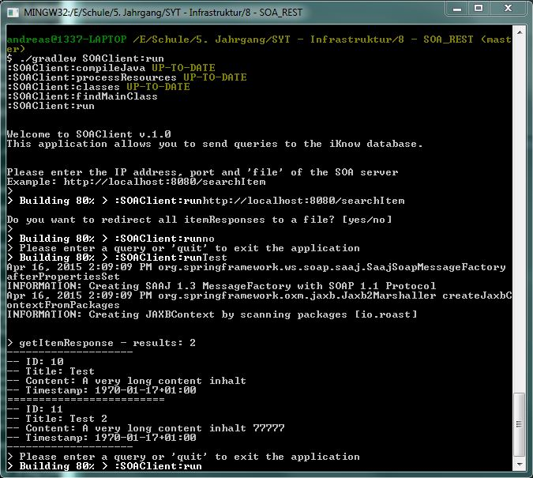

Bigger result:

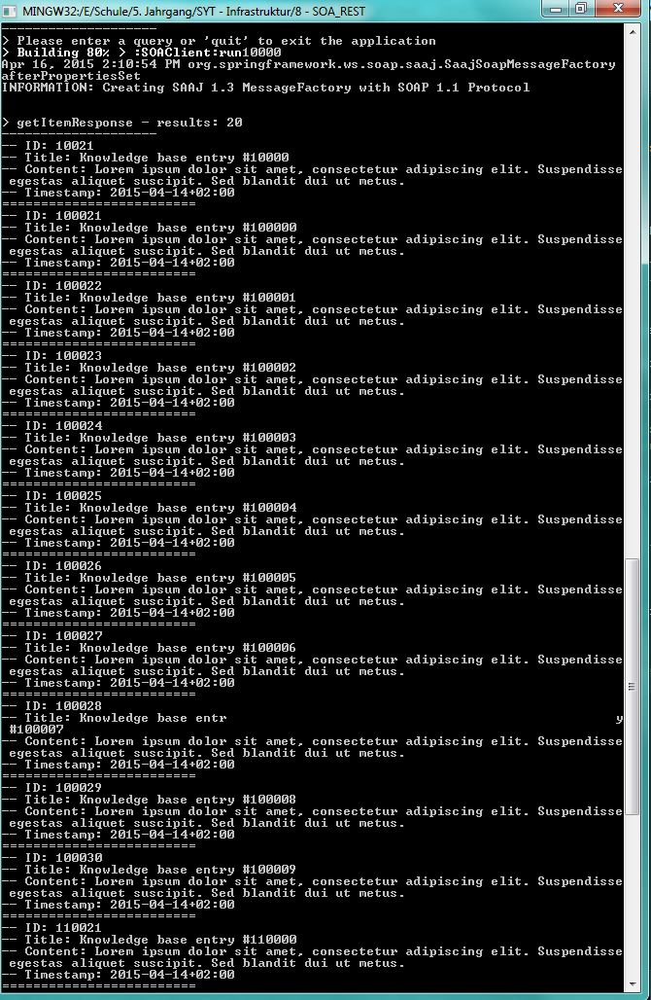

File output
-----------

When receiving a result, the result will directly be saved to the file and only
an information message will be shown.

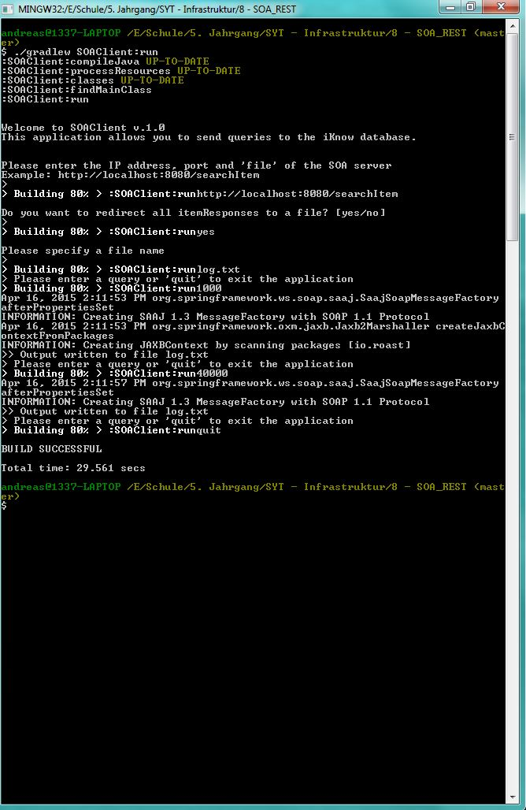

The file:

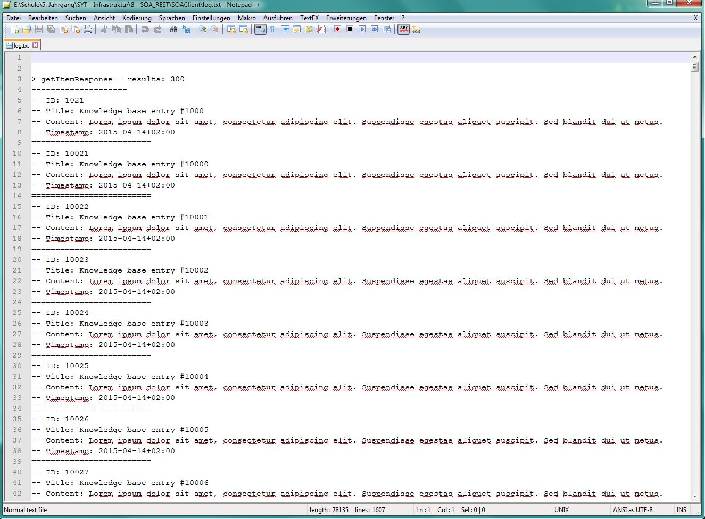

Time recording
==============

Jakob Klepp
~~~~~~~~~~~

================================ ========== ===== ===== =========
Task                             Date       From  To    Duration
================================ ========== ===== ===== =========
Spring Gradle setup              2015-03-27 09:00 11:30   02:30
Spring                           2015-04-10 08:00 10:00   02:00
Testdata                         2015-04-16 09:00 12:00   03:00
**Total**                                               **07:30**
================================ ========== ===== ===== =========

Andreas Willinger
~~~~~~~~~~~~~~~~~

================================ ========== ===== ===== =========
Task                             Date       From  To    Duration
================================ ========== ===== ===== =========
**Total**                                               **08:15**
================================ ========== ===== ===== =========

Sources
=======

.. _1:

[1] "Getting Started Building a RESTful Web Service"
     https://spring.io/guides/gs/rest-service/
     last visited: 2015-04-15

.. _2:

[2] "Getting Started Producing a SOAP web service"
     https://spring.io/guides/gs/producing-web-service/
     last visited: 2015-04-15

.. _3:

[3] "Service-Oriented Architecture (SOA) Definition"
     http://www.service-architecture.com/articles/web-services/service-oriented_architecture_soa_definition.html
     last visited: 2015-04-15

.. _4:

[4] "Representational State Transfer (REST)"
     http://www.service-architecture.com/articles/web-services/representational_state_transfer_rest.html
     last visited: 2015-04-15

.. _5:

[5] "JSON"
     http://json.org/
     last visited: 2015-04-15

.. _6:

[6] "1. Introduction to Spring Framework"
     http://docs.spring.io/spring-framework/docs/3.0.x/reference/overview.html
     last visited: 2015-04-15

.. header::

    +-------------+--------------------+------------+
    | ###Title### | Andreas Willinger, | 2015-04-17 |
    |             | Jakob Klepp        |            |
    +-------------+--------------------+------------+

.. footer::

    ###Page### / ###Total###
